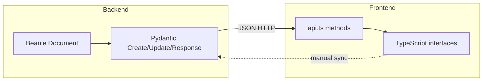

# Audit Dimension 04 — Data Models, Types & Interfaces

**Severity:** Medium  
**Examined:** Type definitions, contracts between layers, validation

## Findings

### F4.1 — Dual schema pattern per entity (Medium)

**Evidence:** Each backend model file defines `Document` (Beanie), `Create`, `Update`, and `Response` Pydantic models — e.g. `backend/app/models/enquiry.py`.

**Risk:** Four shapes per entity to keep in sync. Update schemas with optional fields can accept invalid partial state.

**Direction:** Standard pattern is fine; document canonical shapes in `02_BUILD_SPEC/data_models_and_types.md`.

---

### F4.2 — Manual frontend/backend parity (High)

**Evidence:** `frontend/src/types/index.ts` mirrors backend responses by hand. No OpenAPI codegen.

**Risk:** Field renames or new enums on backend won't break frontend build until runtime. Example: `EnquiryStatus`, `PaymentStatus` duplicated as string unions.

**Direction:** Generate TypeScript from FastAPI OpenAPI (`/openapi.json`) in CI.

---

### F4.3 — Populated response fields inconsistent (Medium)

**Evidence:** `BookingResponse` includes optional `enquiry` and `client` dict fields "added by API" — not in Beanie model.

**Risk:** Frontend must handle both lean and enriched responses depending on endpoint.

**Direction:** Define explicit `BookingDetailResponse` vs `BookingListResponse` types.

---

### F4.4 — Validation at API boundary (Positive)

**Evidence:** Pydantic v2 validators on create/update models (e.g. timezone validation in `RestaurantSettings`, `gt=0` on headcounts).

**Risk:** Low when routes use typed models. Raw dict access would bypass validation.

**Direction:** Ensure all routes use Pydantic request models, not `dict`.

---

### F4.5 — AI extraction returns unstructured dict (Medium)

**Evidence:** `extracted_entities: Optional[dict]` on Enquiry; email processing stores `extracted_data: Record<string, unknown>` on frontend.

**Risk:** Downstream code can't rely on field names without defensive parsing.

**Direction:** Define `ExtractedEnquiryEntities` Pydantic model with required/optional fields documented.

---

### F4.6 — Enum consistency (Low)

**Evidence:** Backend uses Python `Enum` classes; frontend uses string literal types. Values align (`pending`, `confirmed`, etc.).

**Risk:** Low today; breaks on typo without shared source.

**Direction:** Export enums via OpenAPI enum schemas.

## Contract map

**Business risk:** Silent contract drift causes UI bugs in production that are hard to trace. Highest impact on enquiry conversion and invoice flows.
