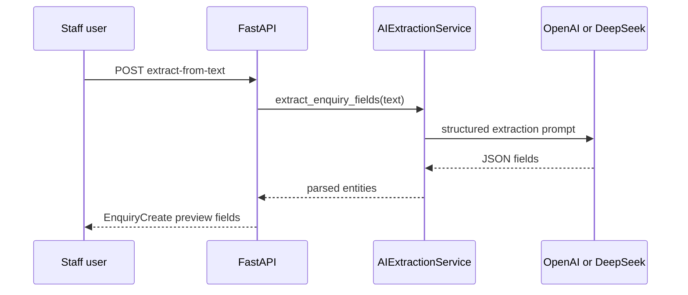

# Audit Dimension 08 — AI / Model Layer

**Severity:** Medium  
**Examined:** Model choice, prompts, guardrails, failure handling, cost

## Findings

### F8.1 — Dual provider with fallback (Positive)

**Evidence:** `AIExtractionService` tries OpenAI (`AsyncOpenAI`) first, falls back to DeepSeek via httpx if OpenAI unavailable.

**Risk:** Two providers mean two prompt/maintenance paths. Fallback behavior must return consistent schema.

**Direction:** Unify response parsing; log which provider served each request.

---

### F8.2 — Manual text extraction endpoint (Medium)

**Evidence:** `POST /restaurants/{id}/enquiries/extract-from-text` — staff paste email/text, AI returns structured fields.

**Risk:** No input length limit documented. Large payloads increase cost and latency.

**Direction:** Cap input at 10–20K chars; return 413 if exceeded.

---

### F8.3 — Email processing AI pipeline (Medium)

**Evidence:** `email_processing_service.py` — intent classification, entity extraction, sentiment. Configurable via env flags.

**Risk:** False positives create enquiries from spam. No human-in-loop threshold documented.

**Direction:** Require confidence score threshold before auto-creating enquiries; queue low-confidence for review.

---

### F8.4 — No cost or rate guardrails (High)

**Evidence:** No per-restaurant token budget, daily cap, or circuit breaker in `ai_extraction_service.py`.

**Risk:** Runaway costs if endpoint abused or email volume spikes. One restaurant's heavy use affects shared API key bill.

**Direction:** Add per-tenant daily limit; cache identical extraction requests.

---

### F8.5 — Prompt stored in code (Medium)

**Evidence:** Extraction prompts embedded in Python strings in `ai_extraction_service.py`.

**Risk:** Prompt changes require deploy. No A/B testing or version history.

**Direction:** Externalize prompts to versioned config files; tag extractions with prompt version in `extracted_entities`.

---

### F8.6 — Failure handling (Acceptable)

**Evidence:** Try/except with logging; returns partial or empty extraction on failure rather than 500 on some paths.

**Risk:** Silent failures may leave staff with empty forms without clear UX message.

**Direction:** Return explicit `extraction_status: failed` with user-visible error in frontend.

---

### F8.7 — PII sent to third-party models (Medium)

**Evidence:** Customer emails, names, phone numbers in enquiry text sent to OpenAI/DeepSeek.

**Risk:** GDPR/privacy policy must disclose AI processing. Enterprise clients may require DPA.

**Direction:** Document in privacy policy; offer opt-out or regional model routing if required.

## AI flow

**Business risk:** AI is a product differentiator but currently a demo-grade integration without production guardrails. Dependable for assisted entry; not yet dependable for fully automated email-to-booking without review.
