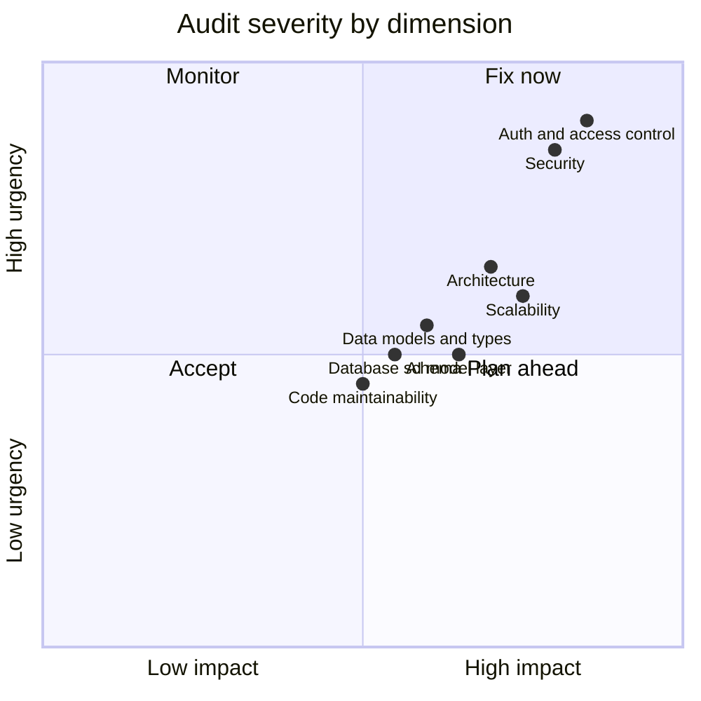
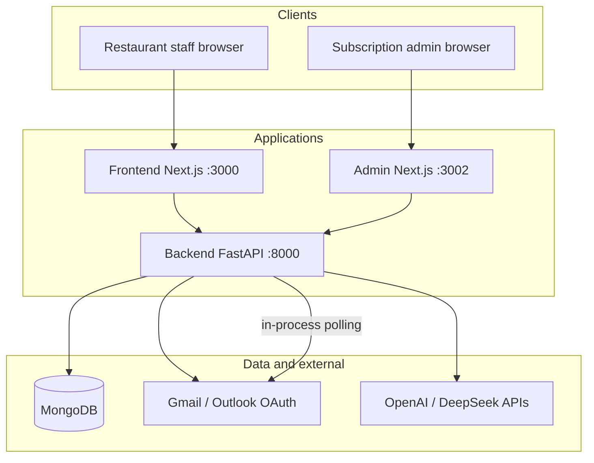

# Part 1 — The Audit

Forensic read of Chef's Console across eight dimensions. Each file lists **findings**, **severity**, **business risk**, and **recommended direction** (diagnostic only — not the build).

## Executive summary

Chef's Console is a **functional MVP** with a clear domain model (Enquiry → Booking → Order) and working AI email extraction. It demos well and supports real restaurant workflows. The primary risks are **multi-tenant isolation gaps on duplicate API surfaces**, **in-process background jobs that won't scale**, **manual type sync between frontend and backend**, and **no formal test or migration infrastructure**.

**Overall posture:** Suitable for early customers with manual oversight. Not yet diligence-ready without addressing Critical/High items in [05_ROADMAP/triage_now_next_later.md](../05_ROADMAP/triage_now_next_later.md).

## Severity heatmap

## System context

## Dimension index

| # | Dimension | Severity | File |
|---|-----------|----------|------|
| 01 | Architecture & system design | High | [01_architecture_system_design.md](01_architecture_system_design.md) |
| 02 | Code structure & maintainability | Medium | [02_code_structure_maintainability.md](02_code_structure_maintainability.md) |
| 03 | Database design & schema | Medium | [03_database_schema.md](03_database_schema.md) |
| 04 | Data models, types & interfaces | Medium | [04_data_models_types_interfaces.md](04_data_models_types_interfaces.md) |
| 05 | Scalability & performance | High | [05_scalability_performance.md](05_scalability_performance.md) |
| 06 | Security | High | [06_security.md](06_security.md) |
| 07 | Auth & access control | Critical | [07_auth_access_control.md](07_auth_access_control.md) |
| 08 | AI / model layer | Medium | [08_ai_model_layer.md](08_ai_model_layer.md) |

## Top 5 risks (founder-readable)

1. **Duplicate enquiry APIs** — Two router modules expose `/enquiries` with different scoping rules. A bug on one surface can leak or corrupt another tenant's data.
2. **DEBUG mode leaks internals** — When `DEBUG=true`, unhandled exceptions return stack traces to the client.
3. **Background email jobs run inside the API process** — One crashed worker takes down email processing for all restaurants on that server.
4. **No automated test suite** — Ad-hoc scripts exist; regressions ship silently.
5. **Frontend types are manually synced** — ~1000-line `types/index.ts` can drift from Pydantic models without compile-time enforcement.

## Next steps

Findings feed directly into [03_WORK_BREAKDOWN/epics/EPIC-06_platform_hardening.md](../03_WORK_BREAKDOWN/epics/EPIC-06_platform_hardening.md) and [05_ROADMAP/triage_now_next_later.md](../05_ROADMAP/triage_now_next_later.md).
