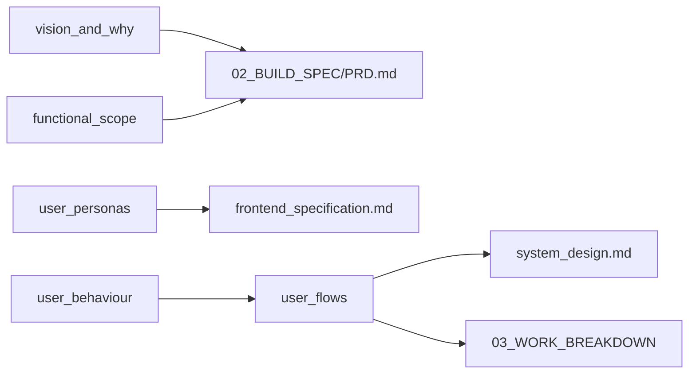

# Part 2 — The Research

Product definition for Chef's Console. Every build spec and task traces back to decisions documented here.

## Artifacts

| Document | Answers |
|----------|---------|
| [vision_and_why.md](vision_and_why.md) | Why this product exists |
| [functional_scope.md](functional_scope.md) | What it does — and what it deliberately does not |
| [user_personas.md](user_personas.md) | Who uses it |
| [user_behaviour.md](user_behaviour.md) | How they actually behave |
| [user_flows.md](user_flows.md) | End-to-end journeys through the product |

## Connection to build

## Sign-off checklist

Before building, confirm with the decision-maker:

- [ ] Vision statement matches business intent
- [ ] Out-of-scope list is acceptable
- [ ] Primary persona is restaurant ops manager (not end diner)
- [ ] Email-first enquiry intake is the default workflow
- [ ] Subscription gate before dashboard access is intentional
