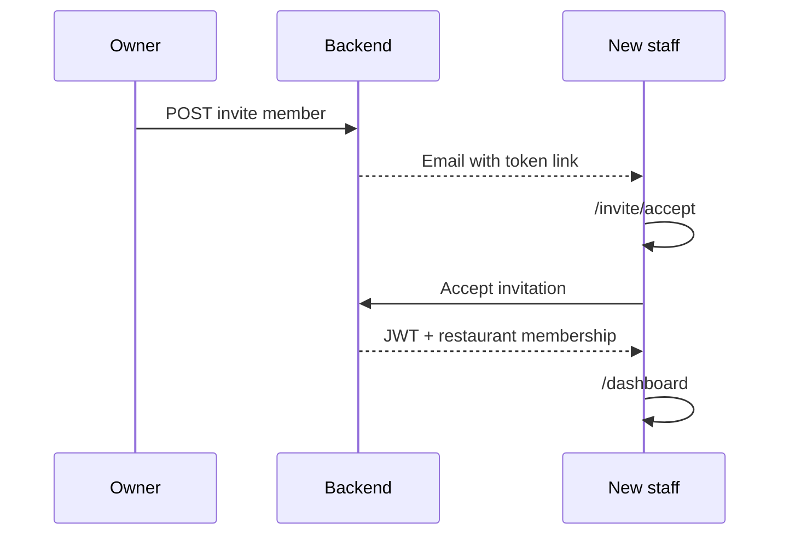

# User Flows & Journeys

End-to-end paths through Chef's Console. Maps to routes in `frontend/src/app/`.

## Flow 1 — New restaurant onboarding

```mermaid
flowchart TD
    Start[Landing page /] --> Signup[/signup]
    Signup --> Verify[/verify-email]
    Verify --> Onboard[/onboarding]
    Onboard --> CreateRestaurant[Create restaurant]
    CreateRestaurant --> SubCheck{Subscription active?}
    SubCheck -->|No| SubPage[/subscription-activation]
    SubCheck -->|Yes| EmailSetup[Connect email optional]
    SubPage --> AdminActivate[Admin activates in admin panel]
    AdminActivate --> Dashboard[/dashboard]
    EmailSetup --> Dashboard
```

**Routes:** `/signup`, `/verify-email`, `/onboarding`, `/subscription-activation`, `/dashboard`  
**API:** `POST /auth/signup`, `POST /onboarding/*`, admin `PUT /admin/restaurants/{id}/subscription`

---

## Flow 2 — Email to enquiry to booking

```mermaid
flowchart TD
    Email[Inbound email] --> Poll[Background email poll]
    Poll --> Process[AI classify and extract]
    Process --> Inbox[/dashboard/email-processing]
    Inbox --> Review[Staff reviews thread]
    Review --> CreateEnq[Create enquiry]
    CreateEnq --> LinkClient[Link client and tour manager]
    LinkClient --> Approve[Approve enquiry]
    Approve --> Convert[Convert to booking and order]
    Convert --> Bookings[/dashboard/bookings]
    Convert --> Calendar[/dashboard/orders-calendar]
```

**Alternate path:** Manual paste at `/dashboard/enquiries` → `POST .../extract-from-text` → save enquiry → convert.

**API:** `POST /restaurants/{id}/enquiries/{id}/convert` creates Booking + Order atomically.

---

## Flow 3 — Team invite



**Routes:** `/dashboard/restaurant-management`, `/invite/accept`  
**Roles assigned:** manager or staff (owner only via transfer — not automated)

---

## Flow 4 — Invoice generation

```mermaid
flowchart LR
    Bookings[/dashboard/bookings] --> Select[Select booking row]
    Select --> Invoice[Generate invoice action]
    Invoice --> PDF[html2pdf in browser]
    PDF --> Send[Email PDF to client manually]
```

**API:** `GET /restaurants/{id}/bookings/{id}/invoice` (backend can also render via WeasyPrint)

---

## Flow 5 — Auth recovery

```mermaid
flowchart TD
    Login[/login] --> Forgot[/forgot-password]
    Forgot --> Email[Reset email sent]
    Email --> Reset[/reset-password?token=...]
    Reset --> Login
```

**Google OAuth alternate:** `/login` → Google → `/auth/google/callback`

---

## Flow 6 — Subscription admin

```mermaid
flowchart LR
    AdminLogin[/admin/login] --> List[/admin/dashboard]
    List --> Toggle[Toggle subscription active]
    Toggle --> API[PUT /admin/restaurants/id/subscription]
```

**App:** Separate admin Next.js on port 3002.

---

## Screen map (dashboard)

| Route | Purpose |
|-------|---------|
| `/dashboard` | Stats overview |
| `/dashboard/enquiries` | Enquiry pipeline |
| `/dashboard/bookings` | Booking table + invoice |
| `/dashboard/orders-calendar` | Delivery calendar |
| `/dashboard/clients` | Client CRUD |
| `/dashboard/email-processing` | Email inbox |
| `/dashboard/settings` | User/restaurant settings |
| `/dashboard/profile` | User profile |
| `/dashboard/restaurant-management` | Team + restaurant config |

Full screen spec in [02_BUILD_SPEC/frontend_specification.md](../02_BUILD_SPEC/frontend_specification.md).
