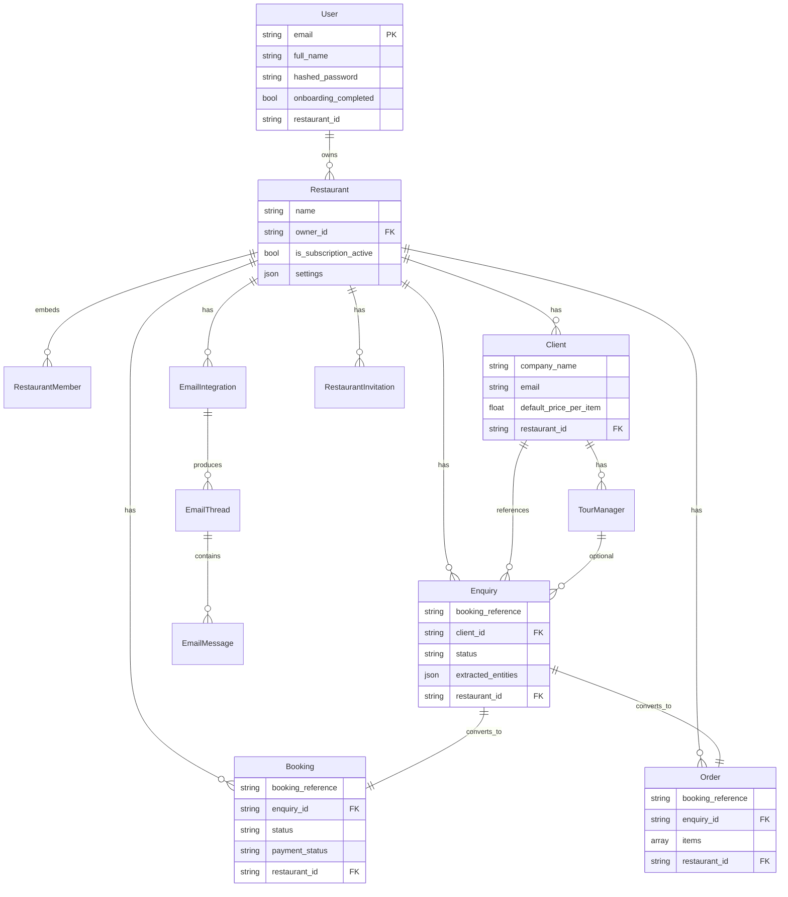

# Database Schema

MongoDB collections managed by Beanie ODM. All tenant-scoped business entities include `restaurant_id: string`.

## Entity-relationship diagram



## Collection reference

### users
| Field | Type | Notes |
|-------|------|-------|
| email | string | unique index |
| hashed_password | string? | null for Google-only users |
| google_id | string? | OAuth |
| onboarding_completed | bool | gates dashboard |
| restaurant_id | string? | **deprecated pattern** — prefer membership lookup |

### restaurants
| Field | Type | Notes |
|-------|------|-------|
| owner_id | string | User.id |
| members | array | `{user_id, role, added_at, ...}` |
| settings | object | currency, timezone, bank_details, working_hours |
| is_subscription_active | bool | gates write access |

### clients
| Field | Type | Notes |
|-------|------|-------|
| company_name | string | |
| email | EmailStr | index with restaurant_id |
| default_price_per_item | float | used in pricing hints |
| restaurant_id | string | tenant key |

### enquiries
| Field | Type | Notes |
|-------|------|-------|
| booking_reference | string | shared key |
| client_id | string | required |
| tourmanager_id | string? | |
| status | enum | new, read, replied, approved, rejected, closed |
| extracted_entities | object? | AI metadata |
| restaurant_id | string | tenant key |

### bookings
| Field | Type | Notes |
|-------|------|-------|
| enquiry_id | string | required back-link |
| booking_reference | string | shared key |
| number_of_people | int | gt 0 |
| total_amount | float | gt 0 |
| payment_status | enum | pending, paid, partial, refunded |
| restaurant_id | string | tenant key |

### orders
| Field | Type | Notes |
|-------|------|-------|
| enquiry_id | string | required |
| items | array | `{id, name, quantity, price}` |
| delivery_date | datetime | |
| restaurant_id | string | tenant key |

### email_integrations
| Field | Type | Notes |
|-------|------|-------|
| provider | string | gmail, outlook, imap |
| oauth_tokens | object | **encrypt at rest** |
| status | enum | active, paused, error |
| restaurant_id | string | tenant key |

## Recommended indexes

```javascript
// bookings
db.bookings.createIndex({ restaurant_id: 1, booking_date: -1 })
db.bookings.createIndex({ restaurant_id: 1, booking_reference: 1 }, { unique: true })

// enquiries
db.enquiries.createIndex({ restaurant_id: 1, status: 1, created_at: -1 })
db.enquiries.createIndex({ restaurant_id: 1, booking_reference: 1 })

// orders
db.orders.createIndex({ restaurant_id: 1, delivery_date: 1 })

// clients
db.clients.createIndex({ restaurant_id: 1, company_name: 1 })
```

## Migration notes

1. No migration tool today — introduce `backend/migrations/` with numbered scripts
2. Adding required fields: backfill with defaults before deploy
3. Renaming fields: dual-write period, then cleanup script
4. Index creation: run off-peak; use `background: true` on Atlas

See skill [04_AI_HARNESS/skills/write_migration/SKILL.md](../04_AI_HARNESS/skills/write_migration/SKILL.md).
