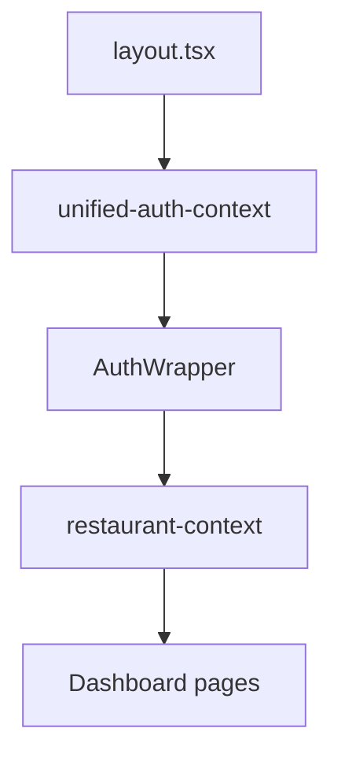

# Frontend Specification

Next.js 15 App Router application at `frontend/src/`.

## Route inventory

### Public / marketing

| Route | Component | API deps |
|-------|-----------|----------|
| `/` | Landing | — |
| `/landing` | Landing alt | — |
| `/pricing` | Pricing | — |
| `/about` | About | — |
| `/contact` | Contact | — |
| `/privacy` | Privacy policy | — |
| `/terms` | Terms | — |

### Auth

| Route | Purpose | API |
|-------|---------|-----|
| `/login` | Email login | POST `/auth/login` |
| `/signup` | Registration | POST `/auth/signup` |
| `/verify-email` | Email verification | POST `/auth/verify-email` |
| `/forgot-password` | Request reset | POST `/auth/forgot-password` |
| `/reset-password` | Set new password | POST `/auth/reset-password` |
| `/auth/google/callback` | Google OAuth | Google auth router |
| `/auth/email/callback` | Email OAuth | — |
| `/auth/set-password` | First password set | POST `/auth/set-password` |

### Onboarding & gates

| Route | Purpose | Guard |
|-------|---------|-------|
| `/onboarding` | Wizard | Auth required |
| `/subscription-activation` | Waiting for admin | Auth + no subscription |
| `/invite/accept` | Team invite | Token in query |

### Dashboard (authenticated + subscription)

Layout: `frontend/src/app/dashboard/layout.tsx`  
Shell: sidebar nav, restaurant selector, user menu

| Route | Primary components | Key API calls |
|-------|-------------------|---------------|
| `/dashboard` | Stats cards, activity | GET dashboard stats |
| `/dashboard/enquiries` | EnquiryTable, ExtractDialog | enquiries CRUD, extract-from-text |
| `/dashboard/bookings` | BookingsTable, InvoiceButton | bookings CRUD, bulk, invoice |
| `/dashboard/orders-calendar` | FullCalendar | GET orders/calendar/events |
| `/dashboard/clients` | ClientForm, ClientList | clients CRUD |
| `/dashboard/email-processing` | EmailInbox, ThreadView | email-processing routes |
| `/dashboard/settings` | SettingsForm | restaurant settings |
| `/dashboard/profile` | ProfileForm | auth profile |
| `/dashboard/restaurant-management` | TeamTable, InviteDialog | invitations, members |

## Global providers



## Route guards

| Guard | File | Checks |
|-------|------|--------|
| AuthWrapper | `components/auth/auth-wrapper.tsx` | JWT valid, onboarding done |
| PrivateRoute | `components/auth/private-route.tsx` | Authenticated |
| PermissionGuard | `components/auth/permission-guard.tsx` | RBAC permission enum |

## Component map (domain)

| Folder | Responsibility |
|--------|----------------|
| `components/ui/` | ShadCN primitives (Button, Dialog, Table, ...) |
| `components/bookings/` | Booking table, inline edit, bulk actions |
| `components/enquiries/` | Enquiry list, create form, extract modal |
| `components/clients/` | Client CRUD, autocomplete |
| `components/email-inbox/` | Thread list, message detail |
| `components/dashboard/` | Stats widgets |

## State management

- **Auth state:** React Context (`unified-auth-context.tsx`) — user, tokens, refresh
- **Restaurant context:** `restaurant-context.tsx` — selected restaurant, persisted localStorage
- **Server state:** Direct fetch via `apiClient` — no React Query today (consider adding)

## Screen states (enquiries example)

| State | UI |
|-------|-----|
| Loading | Skeleton table rows |
| Empty | "No enquiries" + CTA create |
| Populated | Filterable table |
| Extracting | Modal spinner on AI call |
| Error | Toast with API detail message |

## API client

Single class: `frontend/src/lib/api.ts`

Pattern:
```typescript
async getEnquiries(restaurantId: string, params?: FilterParams): Promise<Enquiry[]>
```

**Target refactor:** Split by domain module; types from OpenAPI codegen.

## Types

Canonical TS interfaces: `frontend/src/types/index.ts`  
Must stay aligned with [data_models_and_types.md](data_models_and_types.md).
