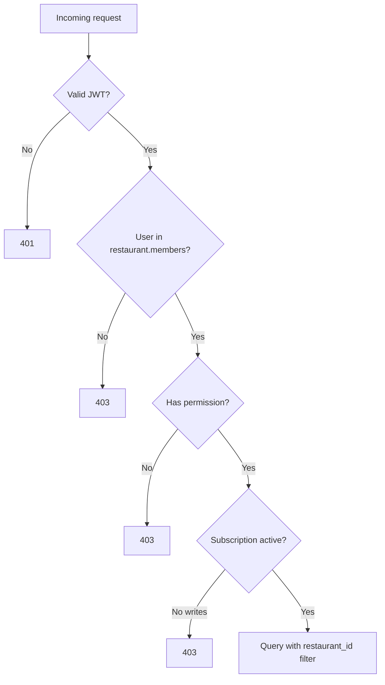

# RBAC & Access Control

## Roles

| Role | Enum value | Typical user |
|------|------------|--------------|
| Owner | `owner` | Restaurant proprietor |
| Manager | `manager` | Ops lead |
| Staff | `staff` | Front-of-house |

Role stored on `Restaurant.members[].role` for each user-restaurant pair.

## Permission model

Permissions are granular strings in `Permission` enum (`backend/app/utils/permissions.py`).

### Permission groups

| Group | Permissions |
|-------|---------------|
| Restaurant | `manage_restaurant`, `update_restaurant_info`, `update_restaurant_settings`, `delete_restaurant` |
| Members | `invite_members`, `manage_members`, `remove_members`, `update_member_roles`, `view_members` |
| Clients | `manage_clients`, `create_clients`, `update_clients`, `delete_clients`, `view_clients` |
| Bookings | `manage_bookings`, `create_bookings`, `update_bookings`, `delete_bookings`, `view_bookings`, `confirm_bookings` |
| Orders | `manage_orders`, `create_orders`, `update_orders`, `delete_orders`, `view_orders`, `process_orders` |
| Enquiries | `manage_enquiries`, `respond_enquiries`, `view_enquiries` |
| Dashboard | `view_dashboard`, `view_analytics`, `view_reports` |
| Settings | `manage_settings`, `view_settings` |

## Role → permission matrix

| Permission | Owner | Manager | Staff |
|------------|:-----:|:-------:|:-----:|
| manage_restaurant | ✓ | — | — |
| delete_restaurant | ✓ | — | — |
| invite_members | ✓ | ✓ | — |
| manage_members | ✓ | ✓ | — |
| update_member_roles | ✓ | — | — |
| manage_clients | ✓ | ✓ | ✓ |
| delete_clients | ✓ | ✓ | — |
| manage_bookings | ✓ | ✓ | ✓ |
| delete_bookings | ✓ | ✓ | — |
| confirm_bookings | ✓ | ✓ | ✓ |
| manage_enquiries | ✓ | ✓ | ✓ |
| respond_enquiries | ✓ | ✓ | ✓ |
| view_dashboard | ✓ | ✓ | ✓ |
| view_analytics | ✓ | ✓ | — |
| manage_settings | ✓ | ✓ | — |

(`✓` = granted via `ROLE_PERMISSIONS` map — verify exact list in source file.)

## Enforcement pattern

```python
@router.post("/")
async def create_booking(
    restaurant_id: str,
    data: BookingCreate,
    current_user: User = Depends(get_current_user_from_token),
    _: None = Depends(require_permission(Permission.CREATE_BOOKINGS)),
):
    await verify_restaurant_access(restaurant_id, current_user)
    ...
```

Every mutating route must:
1. Authenticate JWT
2. Verify user is member of `restaurant_id`
3. Check permission for action
4. Verify subscription active (target — not all routes today)

## Tenant isolation rules



**Rule:** Never fetch by document ID alone — always include `restaurant_id` in query filter.

```python
# Correct
booking = await Booking.find_one(
    Booking.id == booking_id,
    Booking.restaurant_id == restaurant_id,
)

# Wrong — IDOR risk
booking = await Booking.get(booking_id)
```

## Frontend enforcement

`PermissionGuard` wraps UI actions (delete buttons, settings tabs).  
**UI hiding is not security** — backend must always enforce.

## Admin auth (separate)

Admin panel uses `/admin/login` — not part of restaurant RBAC.  
Admin can toggle any restaurant subscription — protect with strong credentials and IP allowlist (recommended).

## Deprecation note

`/enquiries` standalone router bypasses URL-path restaurant scoping — **remove** and use only `/restaurants/{restaurant_id}/enquiries`. See Audit 07.
