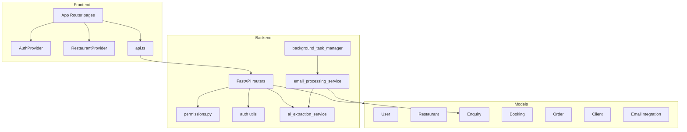
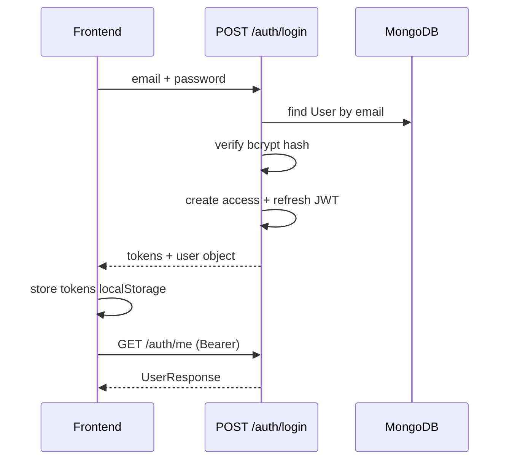
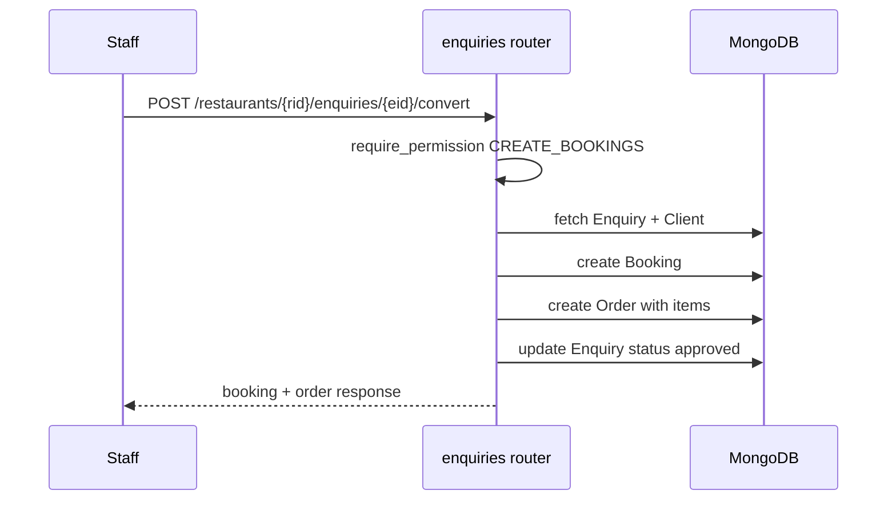
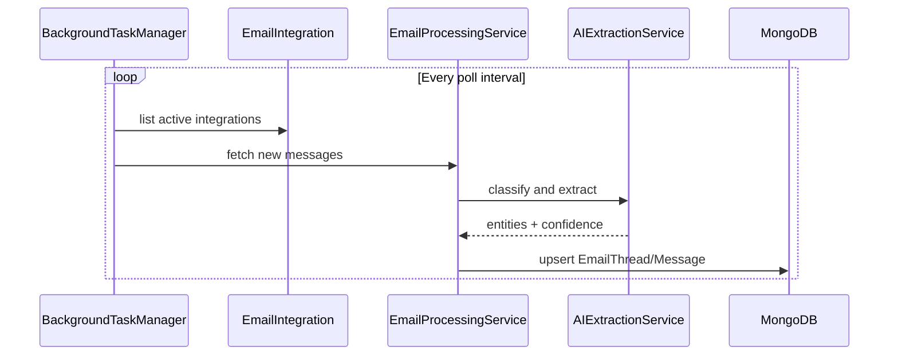
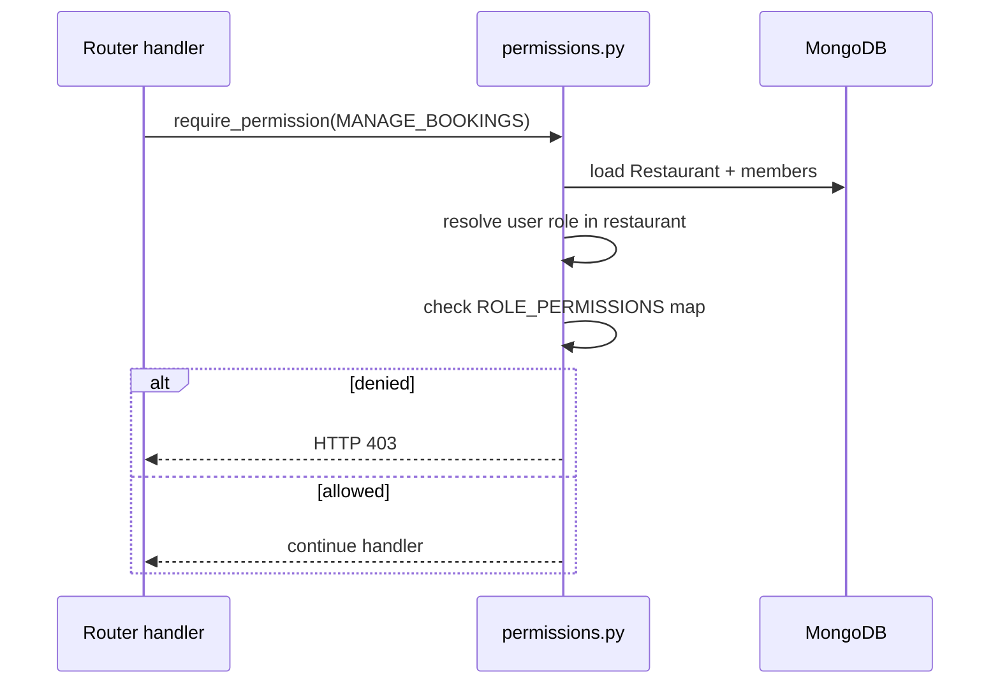
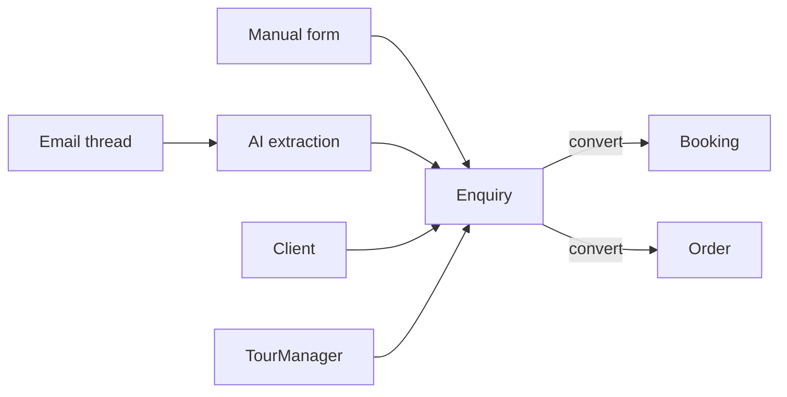

# System Design

## Component diagram

## Sequence: Authentication

## Sequence: Enquiry conversion

**Invariants:**
- `booking_reference` identical across enquiry, booking, order
- `enquiry_id` set on booking and order
- `restaurant_id` on all three matches URL path

## Sequence: Email background processing

**Note:** Staff explicitly creates enquiry from inbox — no auto-convert without user action.

## Sequence: Permission check

## Data flow: enquiry pipeline

## Error handling convention

| HTTP | Meaning | Response shape |
|------|---------|----------------|
| 400 | Validation error | `{ "detail": "..." }` |
| 401 | Missing/invalid JWT | `{ "detail": "Not authenticated" }` |
| 403 | Permission or subscription denied | `{ "detail": "..." }` |
| 404 | Resource not found or wrong tenant | `{ "detail": "..." }` |
| 422 | Pydantic validation | `{ "detail": [...] }` |
| 500 | Server error | `{ "detail": "Internal server error" }` (no stack in prod)

## Single points of failure

| SPOF | Mitigation target |
|------|-------------------|
| API process hosts background jobs | Separate worker |
| Single MongoDB instance | Atlas replica set |
| Shared OpenAI API key | Per-tenant limits + monitoring |
