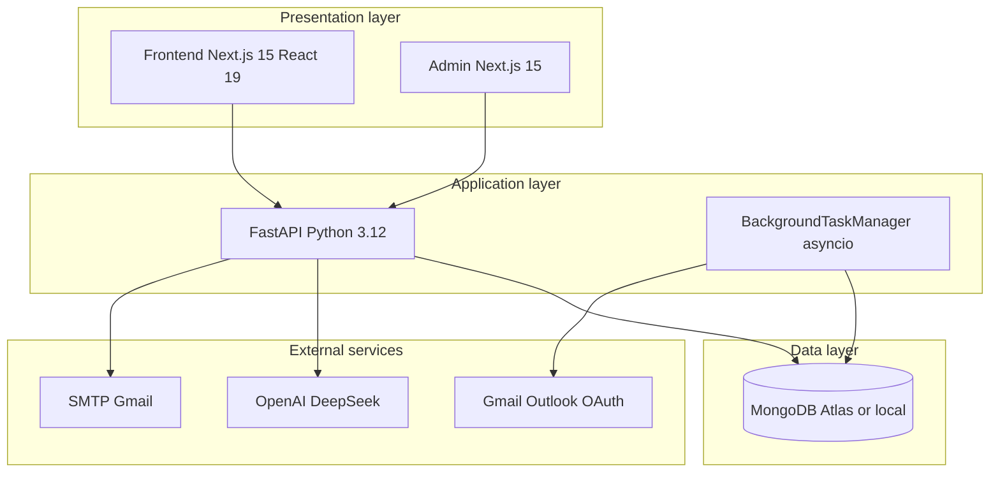
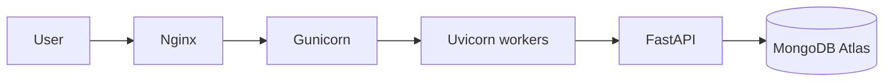

# Technical Architecture

## Stack overview

## Component responsibilities

| Component | Port | Responsibility |
|-----------|------|----------------|
| `frontend/` | 3000 | Restaurant staff UI |
| `admin/` | 3002 | Subscription management |
| `backend/` | 8000 | REST API, auth, email processing |
| MongoDB | 27017 | Primary data store |

## Key technology choices

### Backend: FastAPI + Beanie

**Why:** Async-native, auto OpenAPI, Pydantic validation, rapid MVP iteration.  
**Tradeoff:** Smaller ecosystem than Django; team must own patterns.  
**Alternative rejected:** Django — heavier migration from current code.

### Database: MongoDB

**Why:** Flexible schema for evolving enquiry/email models; document embed for restaurant settings.  
**Tradeoff:** No enforced joins; reporting requires aggregation.  
**Alternative rejected:** PostgreSQL — would require full data migration.

### Frontend: Next.js App Router

**Why:** File-based routing matches current structure; React 19 + ShadCN for speed.  
**Tradeoff:** Server/client boundary complexity for auth context.  
**Alternative rejected:** SPA Vite — would lose SSR/marketing pages integration.

### AI: OpenAI + DeepSeek fallback

**Why:** Quality on GPT models; DeepSeek reduces cost/outage risk.  
**Tradeoff:** Two prompt paths; PII sent to third parties.  
**Alternative rejected:** Self-hosted LLM — ops burden too high for MVP.

## Deployment topology

Production path documented in `backend/deploy.sh`:

**Gap:** Frontend/admin deploy not scripted in repo — document Vercel or static host separately.

## Environment configuration

| Variable | Purpose |
|----------|---------|
| `MONGODB_URL` | Database connection |
| `JWT_SECRET` | Token signing |
| `OPENAI_API_KEY` | AI extraction |
| `DEEPSEEK_API_KEY` | AI fallback |
| `GOOGLE_CLIENT_ID/SECRET` | OAuth login + Gmail |
| `SMTP_*` | Transactional email |
| `DEBUG` | Must be `false` in production |

See `backend/.env.example` for full list. Values are `[REDACTED]` in documentation.

## Target architecture (post-hardening)

Changes from audit recommendations:

1. Extract `BackgroundTaskManager` → standalone worker process
2. Consolidate duplicate routers (restaurants, enquiries)
3. Add CI: pytest + lint + OpenAPI type generation
4. Encrypt OAuth tokens at rest

Detailed sequences in [system_design.md](system_design.md).
