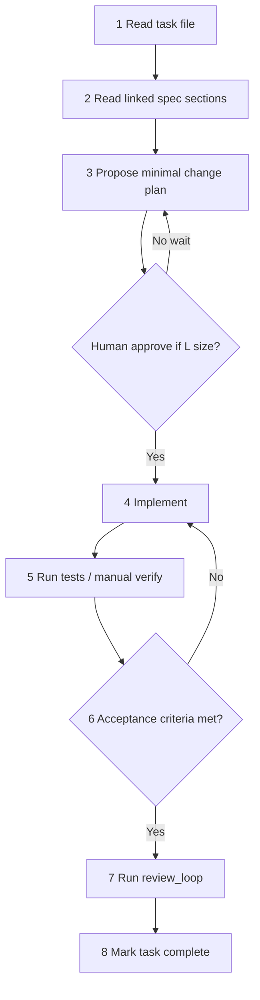

# Agent Loop — Build

Repeat this loop for every task in [03_WORK_BREAKDOWN](../03_WORK_BREAKDOWN/).

## Loop

## Step details

### 1. Read task file
- Note epic, feature, size, dependencies
- Do not start if dependencies incomplete

### 2. Read spec sections
- Links in task → `02_BUILD_SPEC/`
- Check audit findings if security-related

### 3. Propose plan
- List files to touch (max 5 for size S, 10 for M, 15 for L)
- State what you will NOT change

### 4. Implement
- Match existing code style
- Use skills: `add_api_endpoint`, `add_frontend_screen`, etc.
- No drive-by refactors

### 5. Verify
- Backend: `cd backend && source venv/bin/activate && pytest`
- Frontend: `cd frontend && npm run lint`
- Manual: hit affected UI route

### 6. Acceptance criteria
- Check every checkbox in task file
- If cannot meet, stop and report blocker

### 7. Review loop
- Run [review_loop.md](review_loop.md) checklist

### 8. Complete
- Update task file checkboxes
- Reference commit or PR in task notes

## When to stop and ask human

- Schema migration on production data
- Security model change
- Removing public API routes
- Dependency version major bump
