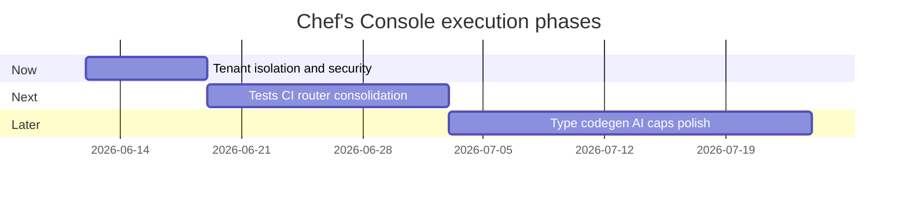

# Part 6 — The Roadmap

Prioritized execution sequence for Chef's Console hardening and growth.

**Principle:** Accuracy first, then speed, then perfection — never reversed.

## Documents

| File | Audience |
|------|----------|
| [triage_now_next_later.md](triage_now_next_later.md) | Everyone — priority buckets |
| [track_a_founder_ai.md](track_a_founder_ai.md) | Non-technical founder + coding agents |
| [track_b_engineering_team.md](track_b_engineering_team.md) | Engineering team |
| [week_one_checklist.md](week_one_checklist.md) | First week — unambiguous actions |

## Quick start

1. Read [triage_now_next_later.md](triage_now_next_later.md)
2. Pick track A or B
3. Open [week_one_checklist.md](week_one_checklist.md)
4. Copy [04_AI_HARNESS](../04_AI_HARNESS/) rules into `.cursor/rules/` if using Cursor

## Timeline overview

Dates are illustrative — adjust to team capacity.
