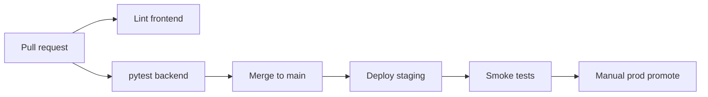

# Track B — Engineering Team

For a team picking up Chef's Console after the teardown.

## Prerequisites

| Item | Owner | Status to verify |
|------|-------|------------------|
| MongoDB Atlas or managed instance | DevOps | Connection string in env |
| Staging environment | DevOps | Mirrors prod topology |
| GitHub repo access | Lead | Branch protection planned |
| OpenAI + OAuth credentials | Lead | In secret manager |
| Admin credentials | Lead | Not in committed JSON file |

## Sprint 0 (1 week) — Foundation

**Goal:** CI green, isolation tests pass, Critical audit items closed.

| Day | Work | Tasks |
|-----|------|-------|
| 1–2 | Tenant isolation | TASK-06-01-01, TASK-06-01-02 |
| 2–3 | Security | TASK-06-05-01 |
| 3–4 | RBAC audit | TASK-05-01-01, TASK-05-04-01 |
| 5 | CI + pytest | TASK-06-03-01, TASK-06-03-02 |

**Review gates:**
- PR requires 1 approval
- CI must pass
- Security tasks require lead review

## Sprint 1 (2 weeks) — Scale path

| Workstream | Tasks | Owner suggestion |
|------------|-------|------------------|
| API consolidation | TASK-06-02-01 | Backend |
| Email worker | TASK-04-02-01, TASK-04-02-02 | Backend |
| Bookings perf | TASK-03-01-01 | Backend |
| Indexes | TASK-06-04-01 | Backend + DBA review |

## Sprint 2 (2 weeks) — Product hardening

| Workstream | Tasks |
|------------|-------|
| Enquiry pipeline | TASK-02-03-01, TASK-02-02-01 |
| Email inbox | TASK-04-03-01 |
| Auth polish | TASK-01-01-01 |
| Type codegen | TASK-06-06-01 |

## Ownership matrix

| Area | Primary | Reviewer |
|------|---------|----------|
| Backend API | Backend engineer | Tech lead |
| Frontend dashboard | Frontend engineer | Design optional |
| Admin panel | Full-stack | Tech lead |
| CI/DevOps | DevOps | Tech lead |
| AI/email | Backend | Security review for tokens |

## CI/CD target state

## Environment promotion

1. **Local** — developer machine, `DEBUG=true` ok
2. **Staging** — `DEBUG=false`, test MongoDB, fake OAuth
3. **Production** — secret manager, encrypted tokens, worker separate from API

## Definition of done (team)

Same as task acceptance criteria plus:

- [ ] PR description links task ID and audit finding
- [ ] No decrease in pytest coverage on touched modules
- [ ] Staging smoke test recorded in PR

## Handoff from founder+AI track

If founder ran Track A first:

1. Run full pytest locally — fix any flaky tests
2. Re-run TASK-06-01-02 isolation suite — don't trust agent-only verification
3. Rotate any secrets that may have been in agent context
4. Archive standalone router code only after grep confirms zero references
